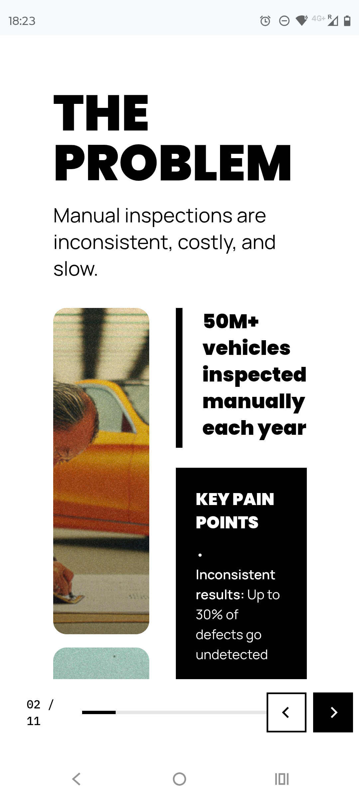
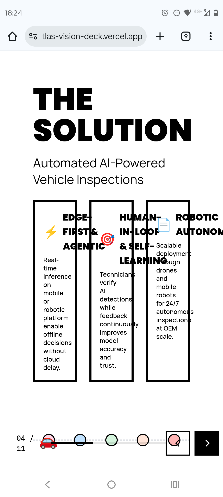

# Mobile Optimization Guide for Atlas Vision Pitch Deck

## Overview

This document outlines the comprehensive strategy and implementation plan for optimizing the Atlas Vision pitch deck for mobile viewing, particularly for portrait-mode phones. Currently, the deck is optimized for desktop/presentation viewing and renders poorly on mobile devices.

## Current Issues (See Screenshots)

### Screenshot Evidence


*Screenshot 1: "THE PROBLEM" slide showing text cut off and poor column layout on mobile*


*Screenshot 2: "THE SOLUTION" slide with three-column layout completely broken, unreadable text*

- **Screenshot_20251010-182349.Chrome.png**: Shows "THE PROBLEM" slide with text cut off, poor column layout
- **Screenshot_20251010-182406.Chrome.png**: Shows "THE SOLUTION" slide with three-column layout completely broken, unreadable text

### Identified Problems
1. **Layout Issues**
   - Fixed desktop widths (e.g., `gridTemplateColumns: '38% 1fr'`) don't adapt to mobile
   - Multi-column layouts (3-column grids) become cramped and unreadable
   - Horizontal scrolling required for some content
   - Text overlaps and gets cut off

2. **Typography Issues**
   - Font sizes too large for mobile screens (`text-6xl`, `text-7xl`)
   - Insufficient line height and spacing
   - Text shadows not visible on small screens

3. **Spacing Issues**
   - Padding values too large (`p-16`, `px-16`)
   - Not enough space between elements when stacked
   - Navigation controls obscure content

4. **Animation/Interaction Issues**
   - Swipe gestures not implemented for mobile navigation
   - Slide transitions may be jarring on mobile
   - Video preloading may cause performance issues

5. **User Journey Concerns**
   - Mobile users may not discover all functionality
   - Navigation controls are small and hard to tap
   - No clear indication of progress through deck

## Responsive Design Strategy

### Core Principles

1. **Mobile-First Breakpoints**
   ```js
   // Tailwind config breakpoints
   screens: {
     'sm': '640px',   // => @media (min-width: 640px)
     'md': '768px',   // => @media (min-width: 768px)
     'lg': '1024px',  // => @media (min-width: 1024px)
     'xl': '1280px',  // => @media (min-width: 1280px)
   }
   ```

2. **Column to Row Transformation**
   - Desktop: Multi-column layouts (2-3 columns)
   - Mobile: Single-column stacked layouts
   - Use Tailwind's responsive grid utilities

3. **Typography Scaling**
   - Desktop: Large, impactful headlines (`text-6xl`, `text-7xl`)
   - Mobile: Scaled-down but still readable (`text-3xl`, `text-4xl`)
   - Fluid typography using `clamp()` for smooth scaling

4. **Touch-Friendly UI**
   - Minimum tap target size: 44x44px (Apple HIG)
   - Swipe gestures for navigation
   - Larger navigation controls

## Implementation Plan

### Phase 1: Core Layout Responsiveness

#### 1.1 Update Container Padding
**Files to modify**: All slide components (`src/slides/*.tsx`)

**Current pattern**:
```tsx
<div className="h-full w-full bg-white p-16">
```

**Mobile-optimized pattern**:
```tsx
<div className="h-full w-full bg-white p-4 sm:p-8 md:p-12 lg:p-16">
```

**Claude Code Prompt**:
```
Update all slide components to use responsive padding:
- Mobile (default): p-4 (1rem)
- Small tablets (sm): p-8 (2rem)
- Tablets (md): p-12 (3rem)
- Desktop (lg): p-16 (4rem)

Apply this pattern to all container divs in src/slides/*.tsx
```

#### 1.2 Convert Grid Layouts to Responsive Stacks

**Problem example** (from Slide2_Problem.tsx:11):
```tsx
<div className="flex-1 grid gap-8" style={{ gridTemplateColumns: '38% 1fr' }}>
```

**Mobile-optimized solution**:
```tsx
<div className="flex-1 flex flex-col lg:grid gap-4 md:gap-8"
     style={{ gridTemplateColumns: 'lg:38% lg:1fr' }}>
```

Or better, pure Tailwind:
```tsx
<div className="flex-1 flex flex-col lg:grid lg:grid-cols-[38%_1fr] gap-4 md:gap-8">
```

**Claude Code Prompt**:
```
Convert all fixed grid layouts in slide components to responsive flex/grid layouts:
1. Find all instances of gridTemplateColumns in inline styles
2. Replace with Tailwind responsive grid utilities
3. Default to flex-col for mobile, grid for lg+ screens
4. Ensure gap scales responsively: gap-4 (mobile) to gap-8 (desktop)

Focus on files: src/slides/Slide2_Problem.tsx, Slide4_Solution.tsx
```

#### 1.3 Fix Typography Scaling

**Problem example** (Slide2_Problem.tsx:8):
```tsx
<h2 className="text-6xl font-black mb-4">THE PROBLEM</h2>
```

**Mobile-optimized solution**:
```tsx
<h2 className="text-3xl sm:text-4xl md:text-5xl lg:text-6xl font-black mb-2 sm:mb-4">
  THE PROBLEM
</h2>
```

**Claude Code Prompt**:
```
Update all typography to scale responsively across breakpoints:
- Headings (h1, h2): text-3xl → sm:text-4xl → md:text-5xl → lg:text-6xl/7xl
- Subheadings (h3, h4): text-xl → sm:text-2xl → md:text-3xl
- Body text (p): text-base → sm:text-lg → md:text-xl
- Margins/spacing: mb-2 → sm:mb-4 → md:mb-6 → lg:mb-8

Apply to all slide components in src/slides/*.tsx
```

### Phase 2: Mobile Navigation & Gestures

#### 2.1 Add Swipe Gesture Support

**File to modify**: `src/App.tsx`

**Implementation**:
```tsx
import { useSwipeable } from 'react-swipeable'

// Inside App component
const swipeHandlers = useSwipeable({
  onSwipedLeft: () => paginate(1),
  onSwipedRight: () => paginate(-1),
  preventScrollOnSwipe: true,
  trackMouse: false, // Only track touch on mobile
})

// Apply to container
<div {...swipeHandlers} className="relative w-screen h-screen overflow-hidden bg-white">
```

**Claude Code Prompt**:
```
Add swipe gesture navigation to the Atlas Vision pitch deck:
1. Install react-swipeable: npm install react-swipeable
2. Import useSwipeable hook in src/App.tsx
3. Configure swipe handlers: left swipe = next slide, right swipe = previous
4. Apply handlers to main container div
5. Ensure swipe only works on touch devices, not desktop
6. Add visual feedback for swipe gestures (optional)
```

#### 2.2 Enhance Mobile Navigation Controls

**File to modify**: `src/components/Navigation.tsx`

**Current issues**: Small buttons, hard to tap on mobile

**Mobile-optimized solution**:
```tsx
// Increase button size on mobile
<button
  className="p-3 sm:p-4 bg-black text-white rounded-lg min-w-[44px] min-h-[44px]"
  onClick={onPrev}
>
  <svg className="w-6 h-6" />
</button>

// Add progress indicator
<div className="flex gap-1">
  {Array.from({ length: totalSlides }).map((_, i) => (
    <div
      key={i}
      className={`h-1 rounded-full transition-all ${
        i === currentSlide ? 'w-8 bg-black' : 'w-1 bg-gray-300'
      }`}
    />
  ))}
</div>
```

**Claude Code Prompt**:
```
Enhance mobile navigation in src/components/Navigation.tsx:
1. Increase button touch targets to minimum 44x44px
2. Add visual progress indicator (dots or progress bar)
3. Make slide counter more prominent on mobile
4. Ensure buttons are positioned to not obscure content
5. Add haptic feedback for button presses (if possible)
6. Test with keyboard navigation still working
```

### Phase 3: Performance Optimization

#### 3.1 Conditional Video Loading

**Problem**: Large videos preload on mobile, causing slow load times

**Solution**:
```tsx
import { useMediaQuery } from 'react-responsive'

const VideoComponent = () => {
  const isMobile = useMediaQuery({ maxWidth: 768 })

  if (isMobile) {
    // Show static image placeholder with play button
    return (
      
    )
  }

  // Show video on desktop
  return <video src="/demo.mp4" autoPlay loop muted playsInline />
}
```

**Claude Code Prompt**:
```
Optimize video loading for mobile devices:
1. Install react-responsive: npm install react-responsive
2. Add conditional rendering for videos based on screen size
3. Show static PNG fallbacks on mobile (create from video first frame)
4. Add optional "play video" button for mobile users
5. Ensure Slide4_Solution user journey animation has a fallback
6. Test that animations don't cause jank on mobile devices
```

#### 3.2 Reduce Animation Complexity on Mobile

**File to modify**: `src/App.tsx`

**Solution**:
```tsx
const isMobile = useMediaQuery({ maxWidth: 768 })

const variants = {
  enter: (direction: number) => ({
    x: isMobile ? 0 : direction > 0 ? 1000 : -1000,
    opacity: 0,
    scale: isMobile ? 1 : 0.8,
  }),
  center: {
    zIndex: 1,
    x: 0,
    opacity: 1,
    scale: 1,
  },
  exit: (direction: number) => ({
    zIndex: 0,
    x: isMobile ? 0 : direction < 0 ? 1000 : -1000,
    opacity: 0,
    scale: isMobile ? 1 : 0.8,
  }),
}
```

**Claude Code Prompt**:
```
Simplify slide transition animations for mobile:
1. Detect mobile viewport using react-responsive
2. Disable slide scale/transform animations on mobile
3. Use simple opacity fade instead
4. Reduce animation duration on mobile (300ms → 200ms)
5. Disable background gradient animations on mobile
6. Test that transitions feel smooth on low-end devices
```

### Phase 4: Content Adaptation

#### 4.1 Create Mobile-Specific Slide Variations

**Approach**: Some slides may need completely different layouts for mobile

**Example**: Slide4_Solution (three-column layout)

**Desktop layout**:
```tsx
<div className="grid grid-cols-3 gap-8">
  <Column1 />
  <Column2 />
  <Column3 />
</div>
```

**Mobile layout**:
```tsx
<div className="flex flex-col gap-4 lg:grid lg:grid-cols-3 lg:gap-8">
  <Column1 />
  <Column2 />
  <Column3 />
</div>
```

**Or use conditional rendering**:
```tsx
{isMobile ? (
  <MobileSlide4Solution />
) : (
  <DesktopSlide4Solution />
)}
```

**Claude Code Prompt**:
```
Create mobile-optimized versions of complex slides:
1. Identify slides with 3+ columns (Slide4_Solution, etc.)
2. Convert to single-column stack on mobile
3. Reorder content for mobile user journey (most important first)
4. Simplify or remove decorative elements on mobile
5. Ensure all text is readable without zooming
6. Test readability on iPhone SE (375px width) and iPhone 15 Pro Max (430px)
```

#### 4.2 Handle User Journey Component

**File**: `src/components/UserJourney.tsx`

**Challenge**: Complex animated journey may not work well on mobile

**Options**:
1. **Simplify**: Show static journey without animation
2. **Vertical**: Stack journey steps vertically instead of horizontally
3. **Fallback**: Show simple numbered list on mobile

**Claude Code Prompt**:
```
Optimize the UserJourney component for mobile viewing:
1. Read src/components/UserJourney.tsx to understand current implementation
2. Create mobile-responsive version that:
   - Stacks vertically on mobile instead of horizontally
   - Simplifies or removes complex animations
   - Uses larger icons and text for touch targets
   - Maintains the core user journey message
3. Test on mobile viewport sizes
4. Consider creating a simple PNG diagram as ultimate fallback
```

### Phase 5: Testing Strategy

#### 5.1 Cross-Browser Testing

**Browsers to test**:
- Safari iOS (iPhone SE, iPhone 15 Pro Max)
- Chrome Android (Pixel 7, Samsung Galaxy S23)
- Chrome iOS
- Firefox Android

**Test checklist**:
- [ ] All slides render without horizontal scroll
- [ ] Text is readable without zooming
- [ ] Navigation buttons are easily tappable
- [ ] Swipe gestures work smoothly
- [ ] Images load properly
- [ ] Videos have appropriate fallbacks
- [ ] Animations don't cause jank
- [ ] No content is cut off
- [ ] Landscape orientation works

#### 5.2 Playwright Mobile Tests

**File to create**: `tests/mobile-responsiveness.spec.ts`

**Test implementation**:
```typescript
import { test, expect, devices } from '@playwright/test'

test.describe('Mobile Responsiveness', () => {
  test.use(devices['iPhone 12'])

  test('All slides render correctly on iPhone', async ({ page }) => {
    await page.goto('http://localhost:5173')

    // Test each slide
    for (let i = 0; i < 11; i++) {
      // Check no horizontal overflow
      const bodyWidth = await page.evaluate(() => document.body.scrollWidth)
      const viewportWidth = await page.evaluate(() => window.innerWidth)
      expect(bodyWidth).toBeLessThanOrEqual(viewportWidth)

      // Check navigation visible
      await expect(page.locator('nav')).toBeVisible()

      // Take screenshot
      await page.screenshot({ path: `tests/mobile-screenshots/slide-${i+1}-iphone.png` })

      // Navigate to next slide
      if (i < 10) {
        await page.locator('button[aria-label*="Next"]').click()
        await page.waitForTimeout(500)
      }
    }
  })

  test('Swipe gestures work on mobile', async ({ page }) => {
    await page.goto('http://localhost:5173')

    // Simulate swipe left
    await page.touchscreen.swipe({ x: 300, y: 400 }, { x: 50, y: 400 })
    await page.waitForTimeout(500)

    // Check we moved to slide 2
    const slideIndicator = page.locator('[data-testid="slide-counter"]')
    await expect(slideIndicator).toContainText('2')
  })

  test('All text is readable without zooming', async ({ page }) => {
    await page.goto('http://localhost:5173')

    // Check font sizes are at least 14px
    const smallText = await page.locator('body').evaluate(() => {
      const allText = document.querySelectorAll('p, li, span')
      const tooSmall = Array.from(allText).filter(el => {
        const fontSize = parseFloat(window.getComputedStyle(el).fontSize)
        return fontSize < 14
      })
      return tooSmall.length
    })

    expect(smallText).toBe(0)
  })
})

test.describe('Tablet Responsiveness', () => {
  test.use(devices['iPad Pro'])

  test('Deck renders correctly on iPad', async ({ page }) => {
    await page.goto('http://localhost:5173')

    // Similar tests as mobile but with tablet-specific expectations
    await page.screenshot({ path: 'tests/tablet-screenshots/landing.png' })
  })
})
```

**Claude Code Prompt**:
```
Create comprehensive mobile testing suite using Playwright:
1. Add tests/mobile-responsiveness.spec.ts with tests for:
   - iPhone 12/13/14 viewports
   - iPad viewport
   - Android phone viewport (Pixel 7)
2. Test for no horizontal overflow on any slide
3. Test swipe gesture navigation
4. Test minimum font sizes (14px+)
5. Test tap target sizes (44px+)
6. Generate screenshots for visual regression
7. Add to CI pipeline
8. Document test results in docs/mobile-testing-results.md
```

#### 5.3 Real Device Testing Checklist

**Devices to test** (if available):
- [ ] iPhone SE (smallest modern iPhone)
- [ ] iPhone 15 Pro Max (largest iPhone)
- [ ] Samsung Galaxy S23
- [ ] Google Pixel 7
- [ ] iPad Air
- [ ] Android tablet

**Test scenarios**:
- [ ] Portrait mode navigation through all slides
- [ ] Landscape mode navigation
- [ ] Slow 3G connection (videos/images load)
- [ ] Airplane mode (cached content)
- [ ] Dark mode compatibility
- [ ] Reader mode compatibility

## Mobile-Specific Considerations

### Option 1: Responsive Design (Recommended)
**Pros**: Single codebase, maintains feature parity, easier maintenance
**Cons**: Requires careful testing, some compromises on mobile

### Option 2: Separate Mobile Site
**Pros**: Fully optimized for each platform
**Cons**: Double maintenance, harder to keep in sync

### Option 3: Static PNG Fallback for Mobile
**Pros**: Guaranteed to work, no performance issues, fast load
**Cons**: Loses all interactivity, animations, not discoverable

**Recommendation**: Use Option 1 (responsive design) with Option 3 as a fallback for very old devices or slow connections.

## Deployment & Monitoring

### Pre-Launch Checklist
- [ ] All responsive breakpoints tested
- [ ] Swipe gestures implemented and tested
- [ ] Videos have static fallbacks
- [ ] Typography scales correctly
- [ ] Navigation is touch-friendly
- [ ] No horizontal scroll on any slide
- [ ] Playwright mobile tests pass
- [ ] Real device testing complete
- [ ] Performance budget met (< 3s load on 3G)

### Post-Launch Monitoring
- Monitor analytics for mobile bounce rate
- Track mobile vs desktop completion rate
- Collect user feedback on mobile experience
- A/B test different mobile layouts if needed

## Resources & References

### Responsive Design Patterns
- [Responsive Images](https://developer.mozilla.org/en-US/docs/Learn/HTML/Multimedia_and_embedding/Responsive_images)
- [Tailwind Responsive Design](https://tailwindcss.com/docs/responsive-design)
- [Mobile-First CSS](https://www.browserstack.com/guide/how-to-implement-mobile-first-design)

### Touch & Gesture Guidelines
- [Apple Human Interface Guidelines - Touch](https://developer.apple.com/design/human-interface-guidelines/inputs)
- [Material Design - Touch Targets](https://m3.material.io/foundations/interaction/states/applying-states#4c4e71e5-ec0d-4b1d-bc17-e41e20cad439)
- [React Swipeable](https://github.com/FormidableLabs/react-swipeable)

### Testing Tools
- [Playwright Device Emulation](https://playwright.dev/docs/emulation)
- [BrowserStack](https://www.browserstack.com/) - Real device testing
- [Chrome DevTools Device Mode](https://developer.chrome.com/docs/devtools/device-mode/)

### Reference Projects
- `/Users/petteri/Dropbox/LABs/KusiKasa/github/homepage` - Good example of responsive layouts with grid-cols-12 patterns
- `/Users/petteri/Dropbox/LABs/dpp-fashion/repository` - Reference for mobile-first design patterns

## Next Steps

1. **Prioritize slides**: Start with most problematic slides (Slide2, Slide4, Slide11)
2. **Create branch**: `git checkout -b feature/mobile-optimization`
3. **Implement Phase 1**: Core responsive layouts
4. **Test early**: Don't wait until all changes are done
5. **Iterate**: Based on testing feedback
6. **Document**: Keep this guide updated with learnings

## Questions for Product Owner

Before implementation, clarify:
1. **Target devices**: What are the primary mobile devices used by your audience?
2. **User journey**: Should mobile users see all slides or a condensed version?
3. **Performance budget**: What's acceptable load time on 3G?
4. **Browser support**: Do we need to support older mobile browsers?
5. **Analytics**: What mobile metrics should we track?
6. **Fallback strategy**: When should we show static content vs. interactive?

---

**Document Status**: Draft v1.0
**Last Updated**: 2025-10-10
**Owner**: Development Team
**Stakeholders**: Product, Design, Engineering
